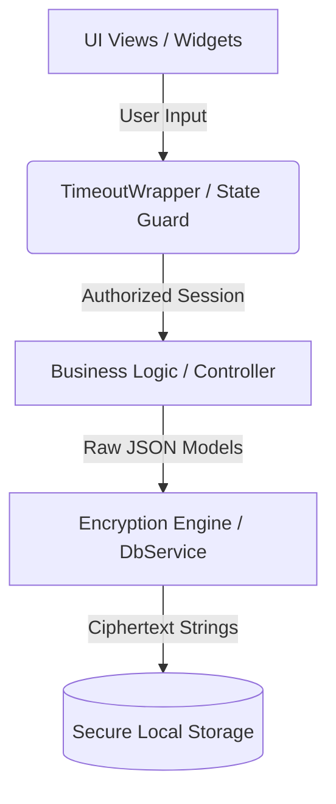

# 💰 Money Ledger

Money Ledger is a lightweight, high-security **Encrypted Expense Tracker** mobile application built using the Flutter framework. Designed with user privacy and data security at its absolute core, the application ensures that all financial transactions, localized budgets, and private expense logs are dynamically encrypted directly on-device before ever being saved to persistent local storage.

---

## 📸 Application Highlights & Interface

* **Material 3 Design System:** A highly polished user experience featuring fluid animations, clear typography, and tactile structural elements.
* **Auto-Adaptive Layouts:** High-fidelity configurations tailored to adapt natively across multiple Android display scaling options.
* **Permanent Security Signature:** Complete with an integrated UI footer establishing authenticity and build version tracking at a glance.

---

## 🔒 Key Security & Core Features

### 1. Advanced Local Ledger Encryption
Unlike traditional financial loggers that write raw text or open-source relational tables directly to storage, Money Ledger pipelines all records through a custom `DbService` layer. 
* Every transaction record is parsed into encrypted block strings before physical write operations occur.
* Data remains completely unreadable to external file system browsers, root explorers, or malicious third-party processes sharing on-device storage permissions.

### 2. Session Timeout Guard (`TimeoutWrapper`)
To mitigate structural vulnerabilities arising when physical devices are left unattended in active states, Money Ledger integrates a structural `TimeoutWrapper`.
* **State Monitoring:** Monitors ambient user interaction events continuously.
* **Auto-Lock Trigger:** If the application registers zero interaction over a predefined tracking interval, the active layout state is stripped and hidden.
* **Shield View:** Users are presented with a secure standalone `LockScreen` interface requiring immediate authentication before re-entering sensitive expense modules.

### 3. Smart First-Time Setup Routine
* **Onboarding Detection:** On app launch, a conditional router evaluates whether an active instance configuration or cryptographic profile already exists within `DbService`.
* **Dynamic Pipeline:** Fresh setups are directed through an initialization wizard to configure basic localized preferences. Subsequent boots bypass onboarding and boot straight behind the session `LockScreen`.

### 4. Adaptive System Theme Engine
* Fully decoupled visual properties support independent, high-contrast dark and light operating contexts.
* Automatically mirrors system-level configuration choices instantly, protecting night-time viewing usability without manual intervention.

### 5. Localized Currency Framework
* Completely built and calibrated out of the box using the **Indian Rupee (₹)** currency standard.
* Core dashboard aggregates, individual ledger logs, and category budget configurations calculate metrics with perfect precision using the local symbol.

---

## 🛠️ System Architecture & Tech Stack



* **Framework Engine:** Flutter SDK (Dart Language)
* **Architectural Layout:** Model-View-Controller (MVC) decoupling with centralized state handling.
* **Security Middleware:** Custom `TimeoutWrapper` layout supervisor.
* **Persistence Layer:** Secure, encrypted local database driver (`DbService`).
* **Platform Target:** Android API 21 and above (Optimized ARM & x64 release binaries).

---

## 🚀 Installation & Local Environment Setup

Follow these explicit commands within your development terminal to clone, assemble, and run the Money Ledger repository on your local machine.

### Prerequisites
Ensure your workstation possesses a fully updated installation of the **Flutter SDK** alongside the complete **Android Studio / Build Tools** platform tools toolchain. Verify the environment status via:
```bash
flutter doctor
```

### 1. Clone the Codebase
Fetch the master project repository directly from your GitHub profile environment:
```bash
git clone https://github.com/CoderPratap-dev/money-ledger.git
cd money-ledger
```

### 2. Synchronize Package Dependencies
Retrieve all explicit structural plugins and assets required by the layout specifications:
```bash
flutter pub get
```

### 3. Execute in Development Environment
Launch an interactive debugging target connected directly to your active physical handset or Android Emulator instance:
```bash
flutter run
```

### 4. Compile Production Release Binaries
To build an optimized, highly compressed standalone installation file stripped of debugging overhead and configured for peak runtime speed:
```bash
flutter build apk --release
```
Upon successful Gradle execution pipeline completion, your finalized installable package will be instantly available at the following target directory:
`build/app/outputs/flutter-apk/TaskZen.apk`

---

## 📋 File System Structural Overview

```text
expense_tracker/
├── android/                  # Native Android configuration files
├── build/                    # Generated compilation outputs & APK binaries
├── lib/                      # Central Application Codebase
│   ├── models/               # Financial log and transaction schema mappings
│   ├── services/             # Encryption routines & DbService configuration
│   ├── views/                # LockScreen, Dashboards, and UI components
│   └── main.dart             # Application initialization entryway hook
├── assets/                   # Icon sets, branding graphics, and fonts
└── README.md                 # Project system documentation
```

---

## 👨‍💻 Author & Project Attribution

* **Lead Developer:** [Coder Pratap](https://github.com/CoderPratap-dev)
* **Release Version Tag:** `v1.0.1`
* **Target Ecosystem:** Android Release Ecosystem
* **Project Status:** Active Production Build

---
<p align="center">
  <b>© 2026 • Made with ❤️ by Coder Pratap</b><br>
  <sub>Securing personal ledger data one byte at a time.</sub>
</p>
